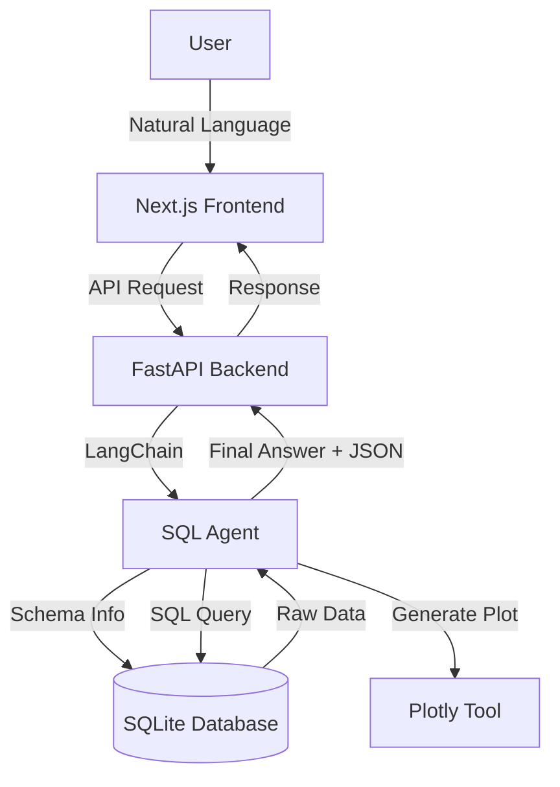

# LUMEN | Data Intelligence Agent

<div align="center">

### 🚀 **[View Live Demo →](https://leonleidner.github.io/text-to-sql-agent/)**

</div>

    

**Bridging the gap between complex databases and actionable business insights.**

LUMEN | Data Intelligence Agent is an advanced **Text-to-SQL Agent** designed to demonstrate the power of Generative AI in Enterprise Data Analytics. It allows non-technical stakeholders to query complex SQL databases using natural language, receive accurate answers, and visualize trends instantly.

---

## 🚀 Key Features

*   **Natural Language to SQL**: Translates business questions (e.g., *"What is the revenue trend for Laptop Pro X?"*) into optimized SQL queries.
*   **Autonomous Agent Architecture**: Built with **LangChain** and **OpenAI/OpenRouter**, the agent understands schema, joins tables, and executes queries securely.
*   **Interactive Visualizations**: Automatically generates **Plotly** charts for data-heavy responses, enabling instant trend analysis.
*   **Modern Tech Stack**:
    *   **Frontend**: Next.js 14 (App Router), TypeScript, Tailwind-free CSS Modules (Glassmorphism Design).
    *   **Backend**: FastAPI, Uvicorn, SQLite (extensible to PostgreSQL/Snowflake).
    *   **Tooling**: FastMCP (Model Context Protocol) for standardized tool execution.

---

## 💼 Business Value & Use Case

In the consulting and enterprise world, data accessibility is often a bottleneck. Decision-makers rely on data analysts to write SQL queries, creating delays.

**LUMEN | Data Intelligence Agent solves this by:**
1.  **Democratizing Data Access**: Empowering managers to get answers instantly without knowing SQL.
2.  **Reducing Time-to-Insight**: From question to visualized answer in seconds, not days.
3.  **Scalable Architecture**: The agentic design allows for easy integration of new data sources and tools.

---

## ⚠️ Important: Running the Application

**The GitHub Pages deployment is a static showcase only.** To use the full "Chat with your Data" functionality, you must run the backend locally, as it requires a Python environment to execute SQL queries and generate plots.

### Prerequisites
*   Python 3.11+
*   Node.js 18+
*   An API Key (OpenAI or OpenRouter)

### 1. Clone the Repository
```bash
git clone https://github.com/leonleidner/text-to-sql-agent.git
cd text-to-sql-agent
```

### 2. Start the Backend (Python)
The backend handles the LLM logic, SQL execution, and plotting.
```bash
# Install dependencies
pip install -r requirements.txt

# Start the FastAPI server
# This will run on http://localhost:8001
uvicorn backend.api:app --reload --port 8001
```

### 3. Start the Frontend (Next.js)
The frontend provides the chat interface and dashboard.
```bash
cd frontend

# Install dependencies
npm install

# Start the development server
# This will run on http://localhost:3000
npm run dev
```

### 4. Use the Agent
1.  Open `http://localhost:3000` in your browser.
2.  Scroll down to the **Interactive Preview**.
3.  Click the **Settings** icon and enter your API Key.
4.  Enable **"Enable Plotting"**.
5.  Ask a question like:
    *   *"Show me the monthly revenue for Laptop Pro X over the last 2 years."*
    *   *"Which product has the highest profit margin?"*

---

## 🏗️ Architecture



---

## 📬 Contact

**Leon Leidner**
*   [GitHub](https://github.com/leonleidner)
*   [LinkedIn](https://www.linkedin.com/in/leon-leidner)

*Built as a showcase for advanced Data Engineering & AI Agent capabilities.*
